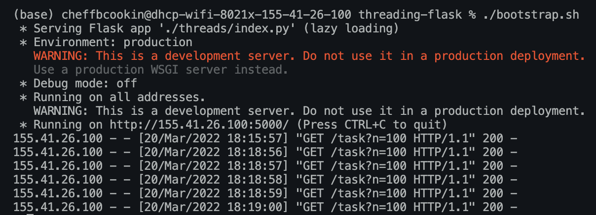
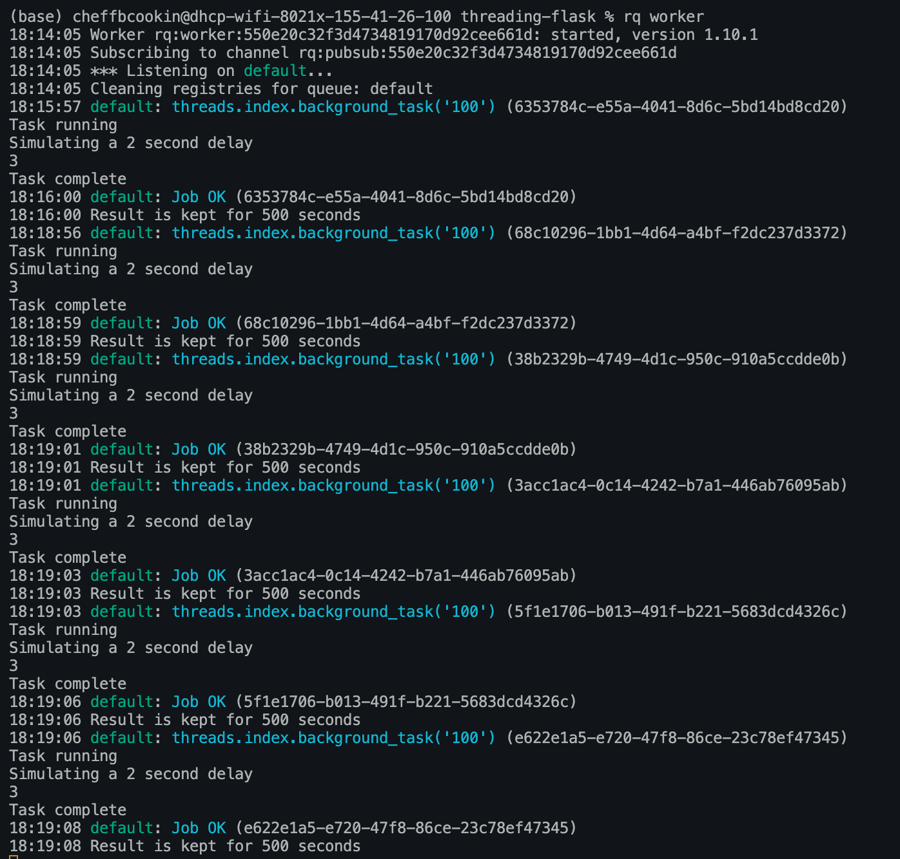

# HealthCare-Application

Platform to monitor patients at home or in the hospitals

Users:
- Patients
- Medical Professionals (Nurses and Doctors)
- Administrators
- Developers:
  - Application developers 
  - Device integrators
  - Machine Learning Scientists

Users Table Content:
- User_ID
- Personal Information
  - DOB
  - Address
  - Primary care provider
  - Billing Info
  - Family members
  - Emergency Contacts
  - Medical Card
  - Insurance
   
- Medical History
  - Height 
  - Weight
  - Gender
  - Medications 
  - Allergy

Device Table Content:
- Device name
- Device ID
- Device MAC Addr
- User it belongs to ID
- User it was assigned by ID
- Firmware version
- Software version
- Date of Purchase/start use

Device Data table:
- User_ID + Device ID
- Data collected time
- Data 

Supplmentary tables:

Roles:
- User_ID
- Role_ID

Role_Definition:
- Role_ID
- Role_Catagory
- Role_permissions

------------------------------------------------------------------------------------------------
How many processes can be handled at the same time?
- However many workers I inialize to handle tasks, which is of course CPU and Memory Bound. This is handled in line 13,14 and 37 of index.py. In stead of viweing the queues with "rq worker", I would have to personally create Worker threads in the code, and the Queue that is displayed below would exist for each individual worker. The enqueing process would be running inside a while loop that consistently adds jobs to the queue of the smallest size, or use a tie breaker when there are multiple with the same sized queue. This process will be implemented when voice transcriber module is being completed. For now I have a working queue able to handle tasks as they come in one at a time. The simultaneous section still requires more work. 

To handle the process of creating multiple workers, I can utilize the following source:
- https://python-rq.org/docs/workers/

Another option to use supervisor for multiprocessing in Redis: (first option is better and easier to implement)
- https://developpaper.com/supervisor-managing-redis-process-methodology-tutorial/

##Threading-flask

Sample application that simulates a delay and runs a background_task. The process of spinning up the sample API is by changing to threading-flask directory and running:
- pip install pipenv 
- pipenv --three
- pipenv install flask
- ./bootstrap.sh

The process of running redis server on macbooks:
- brew install redix
- brew services start redis
- rq worker

Below is examples of me sending multiple requests to the API server, and the API server utilizes a queue hosted by a redis brocker to asynchronously handle all the requests in the background. Thats why the responses are served instantly even though the requests are all sent at the same time. The tasks are asynchronously handled in the background. To check the speed, go to the ip address where the API is running and after the "/" add "/task?n=N" where you replace "N" with any number to differentiate between requests. You will see the responses are served instantly even tough the tasks have a 2 second delay.

Incoming API requests:

Redis Queue Worker handling jobs and assinging IDs:
